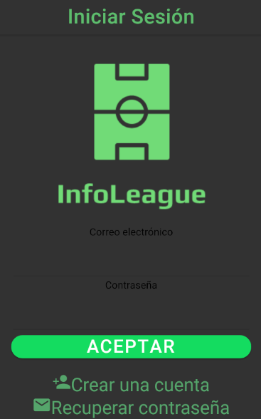
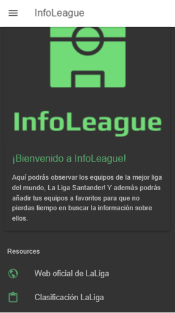
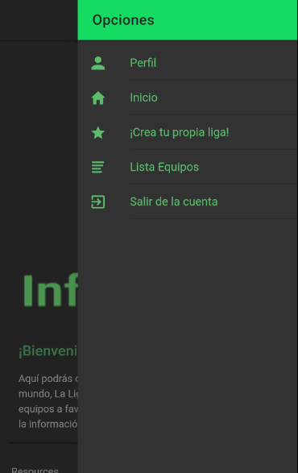
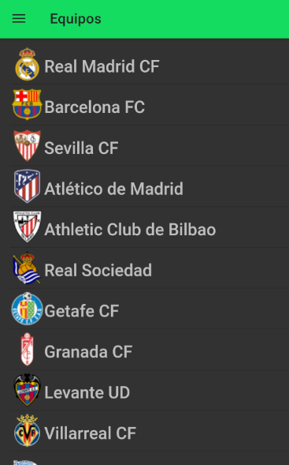
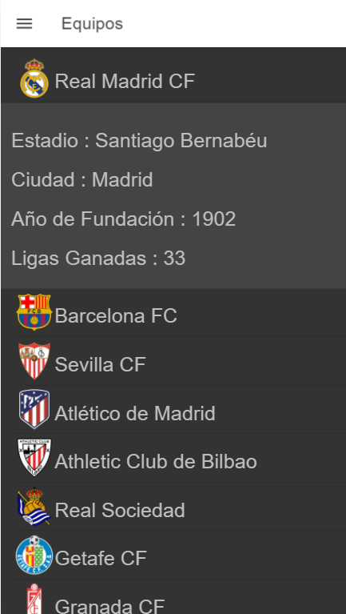
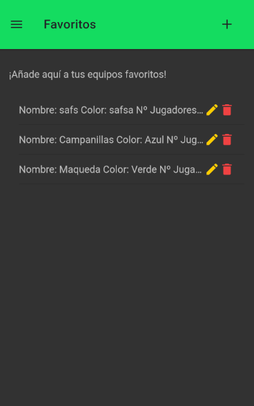
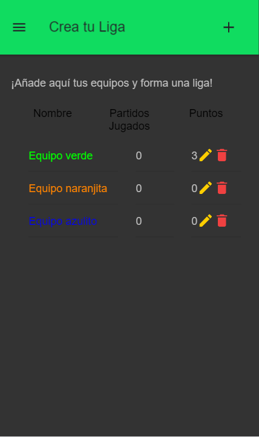
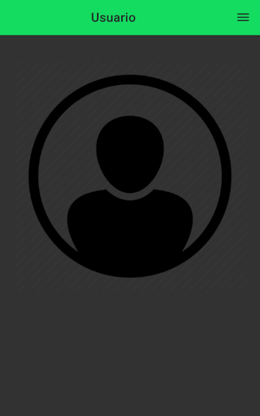

# InfoLeague

Proyecto hecho en Ionic por Juan Luis Aranda Navarro, Alumno de 2º DAM

# Histórico semanal

**(20/03/2020)**
- Realizado **vídeo** de presentación en YouTube del contenido de lo que será la aplicación del **proyecto final**.

**(27/03/2020)**
- Intentando mejorar la página del perfil, para que aparezca el nombre, correo electrónico e información que pueda contener el usuario, como querer cambiar la contraseña, nadamás que obtenga resultados visibles los iré subiendo.

**(17/04/2020)**
- He tocado la página del usuario para empezar a poner que aparezca su correo electónico y su nombre, para que así sea más visual, me queda pendiente coger el correo de la base de datos para mostrar de cada usuario el suyo.

**(08/05/2020)**
- He empezado a buscar información sobre como hacer el sistema de puntos de los equipos añadidos a tu propia liga y he estado intentándolo con un @Pipe pero no he tenido éxito y lo he dejado comentado para seguir retomándolo.

- También tengo pendiente agregar a la base de datos nuevos campos para el perfil de usuario y así poder mostrarlos en la página de dicho usuario. Tengo pensado añadir: Nombre (y que se pueda editar desde la propia página) , correo electronico (ya añadido), edad y la foto de perfil (ya añadido) y terminar haciendo una maquetación de todo para que quede más visual.

# Descripción del Proyecto

Esta aplicación esta orientada al mundo deportivo, haciendo referencia a la **Liga Española de Fútbol** concretamente a la *Liga Santander*, que es la **1ª División**.

El usuario puede ver información básica de los equipos y a su vez puede realizar una liga propia, con sus propios equipos y jugadores.

# Objetivo y público

El objetivo de este aplicación es tener una información simple de los equipos de la 1ª División de España y poder crear tu propia liga.
Es por ello que va orientada a un público al que le guste el fútbol y/o tenga pensado realizar una liga, por ejemplo, serviría para un colegio en el que se hagan ligas en el recreo, para que se puedan apuntar las diferentes clases y competir entre ellas para ver quien es finalmente el ganador de la liga.

# Aspecto técnico

En cuanto al aspecto más técnico de la aplicación, cuenta con un menú principal de hamburguesa en el cual se encuentran las diferentes páginas que contiene la app.
En primer lugar se iniciará dando la bienvenida a la aplicación y dando la posibilidad de entrar sin loguearse para que el usuario sin cuenta pueda ver y observar el contenido de la aplicación pero sin realizar cambios en ella.

Todo esto, estará sujeto a la base de datos de Firebase, la cual recogerá todos los equipos y jugadores que contenga la cuenta del propio usuario.

Y en cuanto al aspecto estético, está realizada con un aspecto oscuro, combinando así el contraste con la información en blanco y en verde.

# Medios a utilizar

Para esta uplicación se van a utilizar estos medios:
- Android Studio para lanzarla en el emulador y ver el correcto funcionamiento de la cámara y otros medios que no se puedan ver en Web.
- Visual Studio para la realización del contenido de la aplicación.
- Firebase para la administración de la base de datos.

# Enlace del vídeo a Youtube

Pincha para ver una breve explicación del funcionamiento de la aplicación. (Versión Inicial)
- https://youtu.be/bVeAX3MLSmc

Breve descripción de la aplicación para el proyecto final:
- https://youtu.be/6iboFCzmeuk

## Login

La aplicación cuenta con un **Login** en Firebase el cual también cuenta con la función de **añadir una cuenta nueva** y **recuperar contraseña** 

## Inicio

Esta sería la pagina principal de la aplicación, la cual te da la bienvenida y ta proporciona dos links:
- Uno a la web oficial de LaLiga.
- Y otro a la clasificación actual de LaLiga

## Menú

Esta aplicación cuenta con un menú en el cual podremos navegar por las diferentes páginas que tiene la aplicación.

## Listado de Equipos

Se muestra un listado de todos los equipos con sus respectivos escudos.

## Listado de Equipos -- Desplegable

En este desplegable se muestra el **Estadio**, la **Ciudad**, el **Año de Fundación** y las **Ligas Ganadas** de cada equipo de LaLiga.

## Crea tu liga

Sobre esta página muestra, una lista de los equipos que hayas añadido escribiéndolos manualmente en el cual, introduces los datos solicitados y en un futuro me gustaría que funcionase como si de una liga se tratase, es decir, que si un equipo tiene más puntos que otro, se colocase por encima de dicho equipo.

Cada equipo añadido cuenta con un botón editar y otro de borrado.

## Editar equipo

Y esta sería la página que nos muestra cuando pulsamos el botón de editar en el equipo añadido.

## Usuario

Esta sería la sección del usuario, en la que por ahora solo tenemos una imagen por defecto, la cual puedes 'clickar' para activar la camara y capturar una foto.

Cuando se añade podrás deslizar hacia la izquierda para poder borrarla y hacer otra foto.

