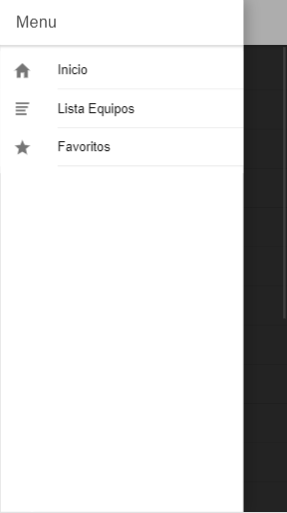
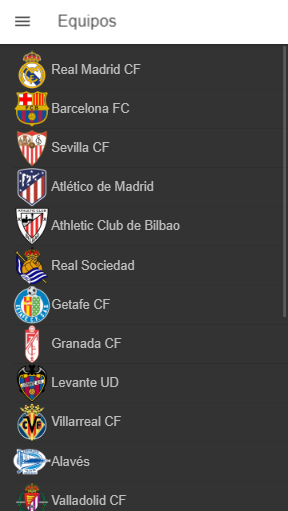
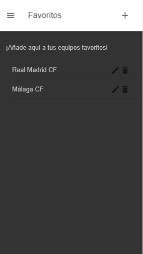

# InfoLeague

Proyecto hecho en Ionic por Juan Luis Aranda Navarro, Alumno de 2º DAM

# Descripción del Proyecto

Este proyecto es una iniciación a Ionic, por ello que muchas de las funcionalidades que me gustaría que tuviera, no están implementadas todavía.

Esta aplicación esta orientada al mundo deportivo, haciendo referencia a la **Liga Española de Fútbol** concretamente a la *Liga Santander*, que es la **1ª División**.

Parte de la aplicación está en desarrollo y me gustaría que el usuario pudiera ver información de los equipos que compiten en esta liga haciendo click en los equipos de la lista.

## Inicio

Esta sería la pagina principal de la aplicación, la cual te da la bienvenida y ta proporciona dos links:
- Uno a la web oficial de LaLiga.
- Y otro a la clasificación actual de LaLiga

## Menú

Esta aplicación cuenta con un menú hamburguesa en el cual podremos navegar por las diferentes páginas que tiene la aplicación.

## Listado de Equipos

Se muestra un listado de todos los equipos con sus respectivos escudos y en el que próximamente añadiré más funcionalidades para que muestren información de cada uno, etc.

## Favoritos

Sobre esta página muestra, al estilo lista de tareas, una lista de los equipos que hayas añadido como favorito escribiéndolos manualmente. Esto es lo que me gustaría corregir para la siguiente versión la cual los podrías añadir pulsando un botón en la propia lista de equipos o con un desplegable en la página favoritos.

Cada equipo añadido cuenta con un botón editar y otro de borrado.

## Editar equipo

Y esta sería la página que nos muestra cuando pulsamos el botón de editar en el equipo añadido.

